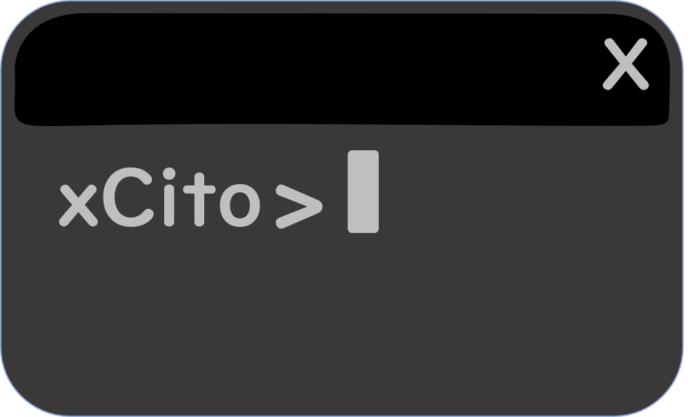

    <h1>Hello World!</h1>
    

This is a place where I like to showcase my personal projects and record how I've been building my skills as a developer. These projects range from playing with physics, messing with animations, to building tools to help other developers.

<h2 align="center">Project Sneak-peeks</h2>

#### Skills 

    <table>
        <tr>
            <td>JavaScript</td>    
            <td>Java</td>    
            <td>C++</td>    
            <td>Nodejs</td>    
            <td>React</td>    
        </tr>
        <tr>
            <td>Angular</td>    
            <td>Regex</td>    
            <td>SQL</td>    
            <td>SOQL</td>    
            <td>HTML/CSS</td>    
        </tr>
    </table>

#### Areas of interest
* Frontend Web Development
* Backend Web Development
* NLP

    

<!--
**xCito/xCito** is a ✨ _special_ ✨ repository because its `README.md` (this file) appears on your GitHub profile.

Here are some ideas to get you started:

- 🔭 I’m currently working on ...
- 🌱 I’m currently learning ...
- 👯 I’m looking to collaborate on ...
- 🤔 I’m looking for help with ...
- 💬 Ask me about ...
- 📫 How to reach me: ...
- 😄 Pronouns: ...
- ⚡ Fun fact: ...
-->
